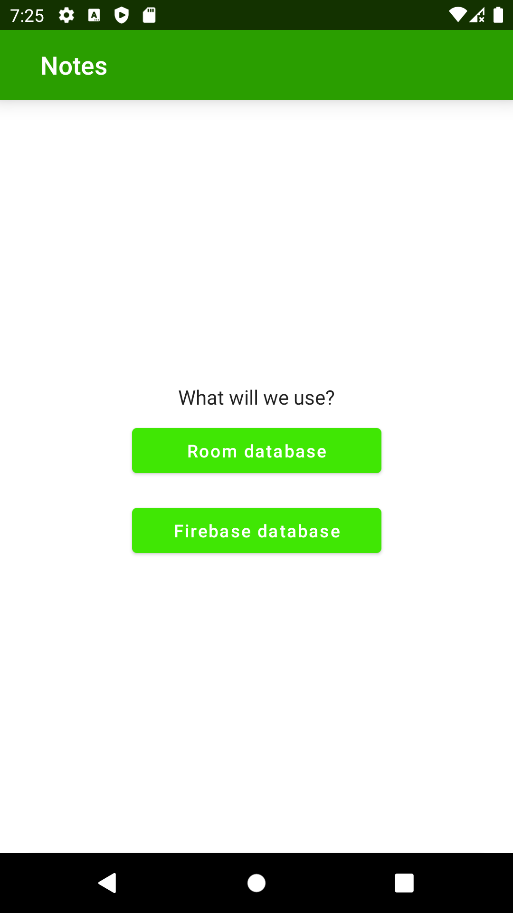
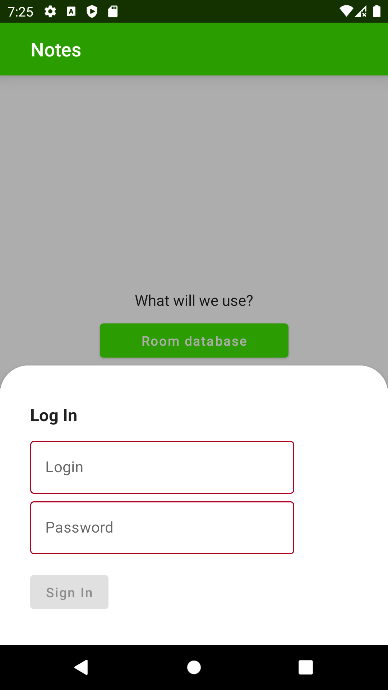
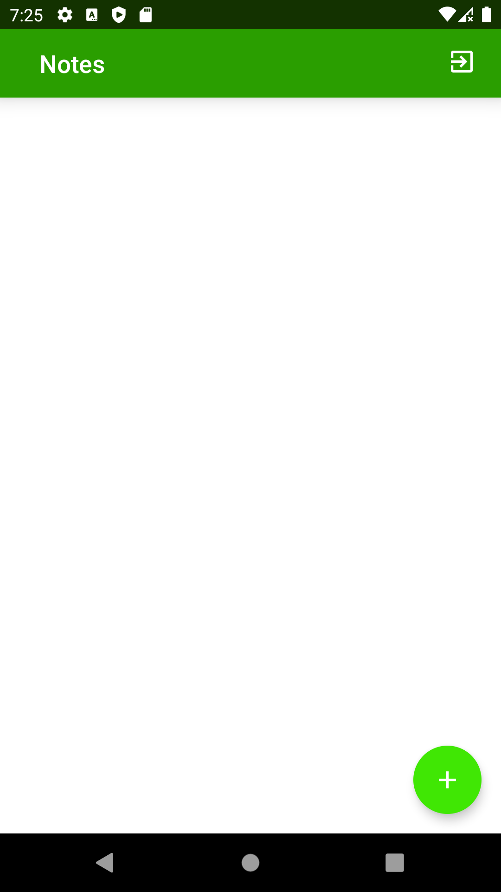
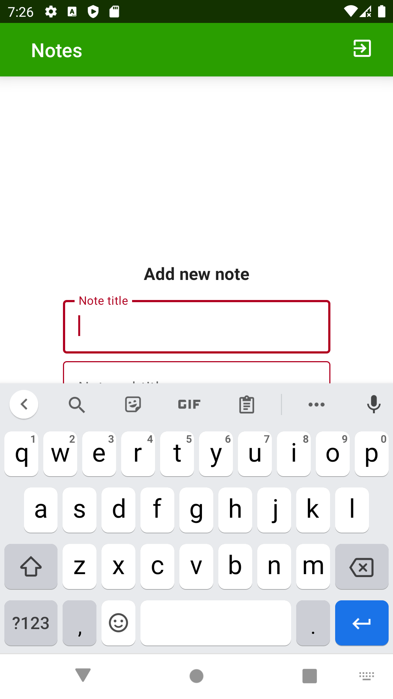
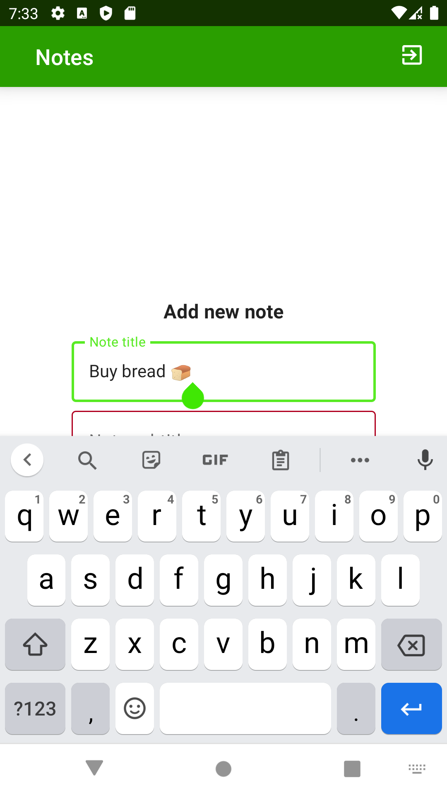
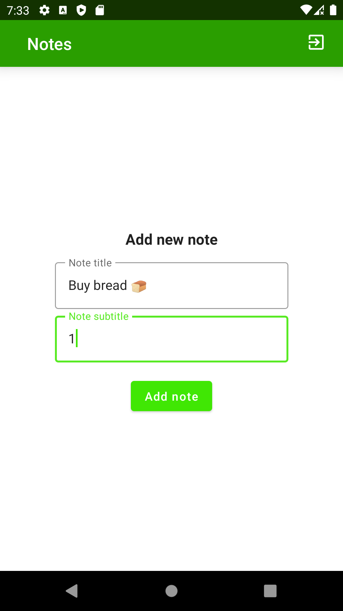
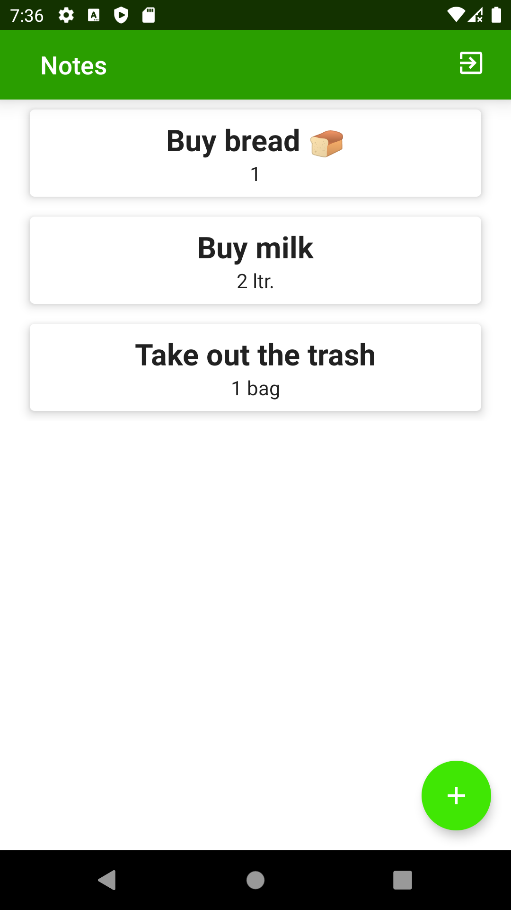
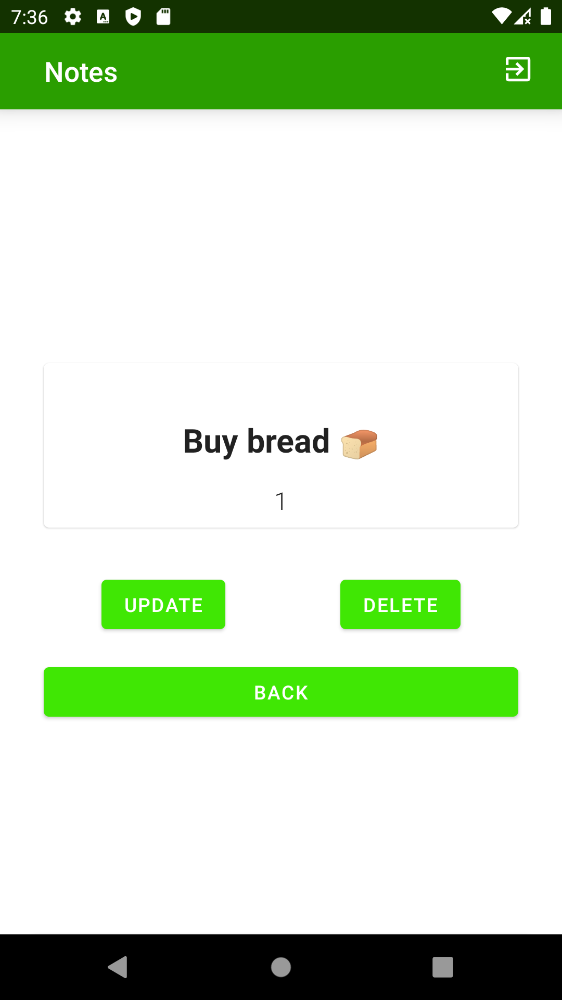
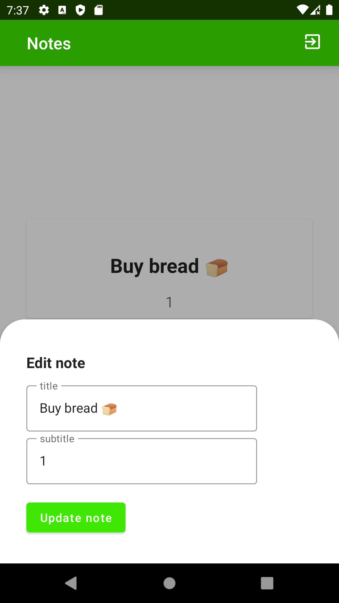

# Notes App Compose MVVM
## 📜 &nbsp;Description app:

Sporting Events Calendar 2022 - Jetpack Compose

## 🛠 &nbsp;Tech Stack

* Android SDK
* Kotlin
* MVVM
* Jetpack Compose
* ViewModel
* Compose Navigation
* LiveData
* Kotlin Coroutines
* Room (SQLite)
* Firebase SDK

## 📸 &nbsp;Screenshots

 
 
 
 
 
 
 
 
 

